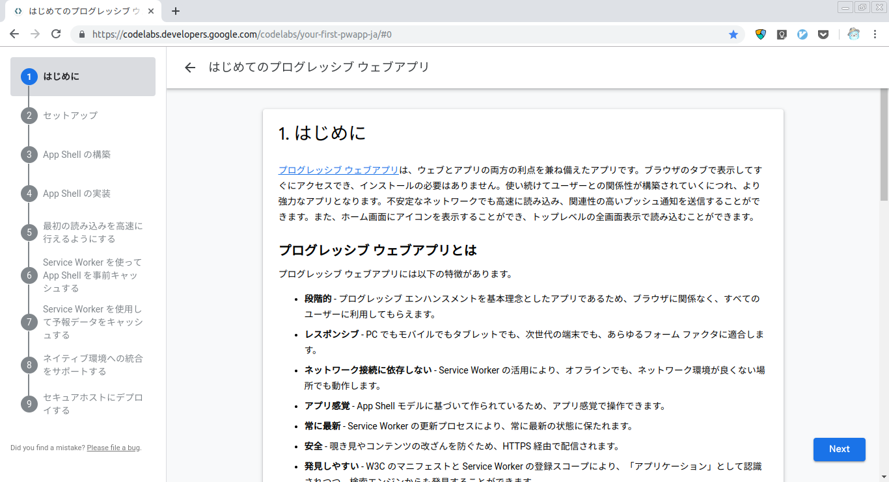
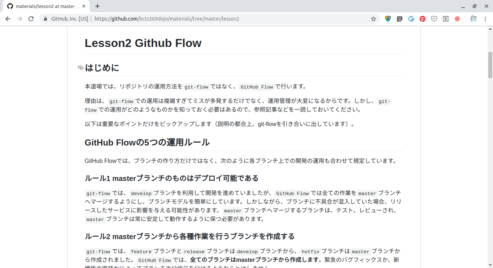
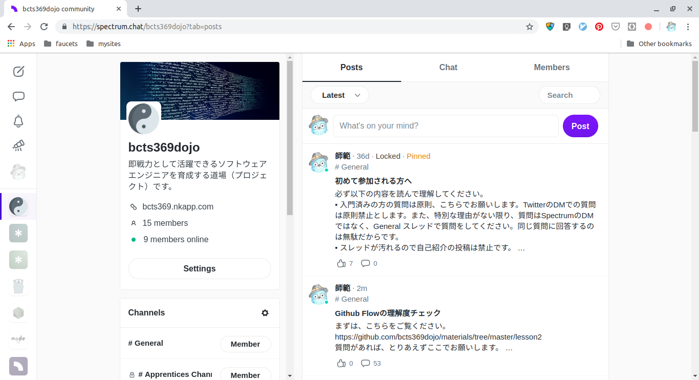

# BCTS369道場紹介

## 生徒募集キャンペーン

現在、私は道場の運営の他、受託開発も行って生活を保っています。道場に集中したいという思いが強くなる一方で、生徒数が少ないと生活（子供の教育含む）確保が難しくなります。よって、キャンペーンを行い、生徒数を増やしたいと思います。50名に達した時点でキャンペーンを終了します。

生徒さんをご紹介いただいたき、入門された場合は、その方の支払方法（６ヶ月、１年）に応じて、10%をお支払します。
さらに、紹介いただいた生徒さんの場合も10%割引します。
支払い方法が１ヶ月単位の場合は対象外です。

紹介された生徒さんが、応募時に紹介者のTwitterアカウントを伝えていただく必要がありますので、ご注意ください。
相互紹介は無効です。

紹介料のお支払は、紹介いただいた生徒さんの送金を確認後、できるだけ速やかに行いたいと思います。
ただし、了解料のお支払はビットコイン（BTC）または、リップル（XRP）で行います。

紹介いただき、入門確定後に、紹介者のTwitterアカウントにご連絡しますので、その際に送金先アドレスを伝えていただきます。

なお、道場の案内については、以下をご覧ください。

## はじめに

日本はもちろん、世界中でプログラミング学習によって得られる、論理的思考能力、問題解決能力の向上などに注目が集まっています。

そして、社会では副業やフリーランスとしての活動制限が緩和されつつあり、デザイナーやプログラマーを目指す人も非常に増えています。

それに乗じて、プログラミングスクールやプログラミング学習サイトもどんどん増えています。

それらの学習サービスを利用して学ぶことはとても良いことだと思います。しかし、プロのプログラマー（以降エンジニアと表記）として活躍できるようになるかどうかについては別です。

なぜなら、プログラミングを学んだだけでは、その人は実際の開発業務では全く使える状態ではないからです。もちろん、いきなりバリバリ開発できる人もまれにはいますが、多くの人はそうではありません。

開発現場で仕事ができるようになるためには、プログラミングとは直接関係のない多くのことを習得する必要もあります。また開発業務中には様々な調査や意思決定も必要になります。

それらを机上で体験することはほとんど無理なため、最も効果的な学習方法はインターンとして開発現場での業務を体験することですが、そういう機会を得られない方も多くいると思います。

**本道場は、就職後すぐに即戦力として活躍できるエンジニアの育成を行っていきます。**

エンジニアとして一度も就職もせず、いきなりフリーランスになることは推奨していません。

生徒さんが育っていけば、後輩指導や共同プロジェクトに参加することで、収入を得ることも可能です。 弟子と、生徒さん次第なので、今の所は絶対に実現するかどうかは約束できません。

## 本道場の指導方針概要

- プログラマではなく、ソフトウエアエンジニアとして育成します（以降エンジニアと表記）。
- 一般的なプログラミングスクールとは違い、スタートアップのような小規模企業に就職後、即実戦投入されたという想定の元で進めていきます。
- サーバーサイド技術の習得をメインとし、**Go言語をメイン**で使用します。 課題の内容によっては、`JavaScript`や`Python`も一部使用します。
- エンジニアとして仕事を遂行するために必須の知識とやるべきことを指導します（人としても）。
- 現場と同様、プログラミング言語の文法そのものは原則教えません（自習するための情報は伝えます）。
- 就職したら即戦力として働けることを目標に指導します。
- 原則、課題は自分自身では選択できません、当方の指導の順番に課題をこなしていただきます。
- 暗号資産（仮想通貨）の自動取引や**ブロックチェーン**についても指導します（初級卒業以降）。
- 就職前後の相談を受け付けます。
- お互いを高め合うために、弟子、生徒間の交流を推奨します。
- 門生が育った後、独自のプロジェクトを立ち上げ、皆で設計開発＆運用を行います。収益が得られれば分配します。

## より具体的には

- 門生への指示、門生間の交流は基本的には、[Slack](https://slack.com/intl/ja-jp/)と[spectrum.chat](https://spectrum.chat/bcts369dojo/)で行います（要アクセス権）。
- 課題に関する質問、相談、回答は上記`Slack`もしくは、GitHubの`issue`と`Pull Request`内で行います。
- 指導で使うGitHubのリポジトリは原則、パブリックとし、誰もが閲覧できるようにします。
- 作業の殆どはGithubとローカルリポジトリで行っていただきます。
- 教材は、課題に取り組み、理解度チェックを受けるために必要最低限を提供します。
- 課題よっては、課題を完了するまでの期限を設ける場合があります。
- 教材は、独自のものも作りますが、外部に良いものがあればそれも利用します。
- 本道場では、教材自体を重要視しておらず、課題を与えられ、それを遂行、完成に至るまでのプロセスを最も重視しています。

## 道場の基本ルール

- 質問はSlackと、GitHubで行うこと（場合によってはTwitterでもOK）。
- 技術的な質問する前には、必ず自分自身で調査をすること。
- できるだけ、自分の質問に質問をされないよう心がけること。
- 自分で解決できそうもない場合は、素直に質問すること。
- パーフェクトを追求しすぎない（後から改善できます）。
- 注意を受けたら、腐らずに受け入れること（頑張れば注意されることはおのずと減っていきます）。

## 学習の流れ

現在のところ、次のような流れで学習いただいております。

1. Slackで課題内容を連絡
2. 課題をクリアするための自習
3. 理解度チェックとレビュー（主にGitHubのプルリクエストとSlackを使用）

## カリキュラム

本道場では、サーバーサイドを中心にプログラマが知るべき技術や仕事の仕方を伝えていきます。フロントサイドエンジニアであっても、サーバーサイドについて知ることは非常に重要だと思います。

プログラミング言語については、ここ数年最も注目されていると言っても良いGo言語を使用します。業界必須のJavaScriptやPythonについても、教材の内容によっては一部使用します。

カリキュラムは生徒の進捗を見ながら、決め次第、随時追加していきます（ネタとしてはいろいろありますが、できるだけ生徒が楽しめたり、実用的に利用できる内容をチョイスしたいと思います）。

[カリキュラムの詳細](https://github.com/bcts369dojo/materials)を参照してください。

教材は、次のような2パターンです。

パターン１

パターン２

サポート、コミュニケーション用チャット

## 募集概要

- PC環境
  - macOS、Linux
  - Windowsを利用中の場合は、Linux環境をなんらかの方法で導入していただきます。
- 年齢
  - 18歳以上、35歳付近まで。
- その他
  - 一般的なPC操作を普通にこなせていること。
  - 一般的なコミュニケーション能力があること。
  - まずは自分なりに調査してみて、相手に伝わる質問ができる人。

上記条件を満たしておられ、入門に興味がある方は [@bcts369](https://twitter.com/bcts369) にDMにてご連絡ください。
まずは、簡単なインタビューをさせていただきます。

## 指導料

私のポリシーとして、学習者に必要以上にお金の負担をかけたくないというおもいがあります。
また、他の学習サービスと比較して破格の値段ですが、決して手を抜くつもりはありません。成長していただいた後に私が計画中のプロジェクトに参加していただいて、利益を出していただければ、これほど嬉しいことはありません。あまったお金で是非新しいPCなどを購入してください。

- 月謝7,980円（前払い制。入門時に初回の費用をお支払いいただきます）
- １年間一括活払いの場合は 86,184円（10%割引）です。
- 半年一括払いの場合は、43,092円（10%割引）です。
- 当方としましては、一括払いをしていただけると（毎月請求するなど）お金の管理面で楽になるので助かります。
- 退門を希望する場合は、必ず１月前にご連絡ください。無届のまま活動していない場合でも在門扱いとなり、その間の月謝は全額納入して頂きます。

## お支払い方法

いずれのお支払であっても手数料はご負担ください。暗号資産のXRPで送金すれば手数料はかなり安くなります。

- 暗号資産（仮想通貨）でのお支払
  - BTC、XRP、XEM
  - 振込先アドレスは毎回変わりますので、都度お知らせします。
  - Twitterまたはメールでお伝えします。
- 銀行振込でのお支払
  - Twitterまたはメールでお伝えします。

## 免罪事項
- 努力しているにも関わらず、完全に不向きと判断した場合は6ヶ月以内に通達しますが、支払い済みの入門料と月謝をお返しすることはありません。
- 素晴らしい成果が出るかどうかは、その人の努力と適正によります。
- 当道場で知り得た技術を利用して犯罪に加担、又は当事者となっても、当方は一切の責任をおいません。

## About me

本道場（bcts369dojo）の師範です。簡単に私について紹介させていただきます。

過去を含めた私についての詳細（業務経歴書など）を知りたい方はご連絡ください。別途URLをお伝えします。

- 30年以上、プロのソフトウエアエンジニアとして活動しています（現役）。
- 15年間（3社）で働いた後、フリーランスとなり、現在フリーランスエンジニア16年目を迎えております。
- 前職、前前職の途中から、開発部の部長を拝命して業務を遂行しました。
- 過去に仕事で経験したプログラミング言語は10数種類。
- 開発の分野的には、ファームウェアから、WEBシステム管理、Macアプリ開発、WEBアプリ開発、モバイルアプリ開発など、殆どの分野を経験してきました。
- 子供がプログラミングを始めたことにより、教育に興味を持ちました。
- 趣味はプログラミングと料理。
- 1日1食のプチ断食生活を継続中。
- 平均睡眠時間は７時間（特にタイマーをセットしていないが自然と目が覚める）。
- 好きなエディタはVim系。近年はNeoVimを愛用。たまにVSCodeも使用している。
- 好きなプログラミング言語はGo、Python、C。
- 暗号資産でのトレード歴4年。同時に自動取引開発も継続している。
- 好きな通貨はBTC、LTC、XLM、XEM。
